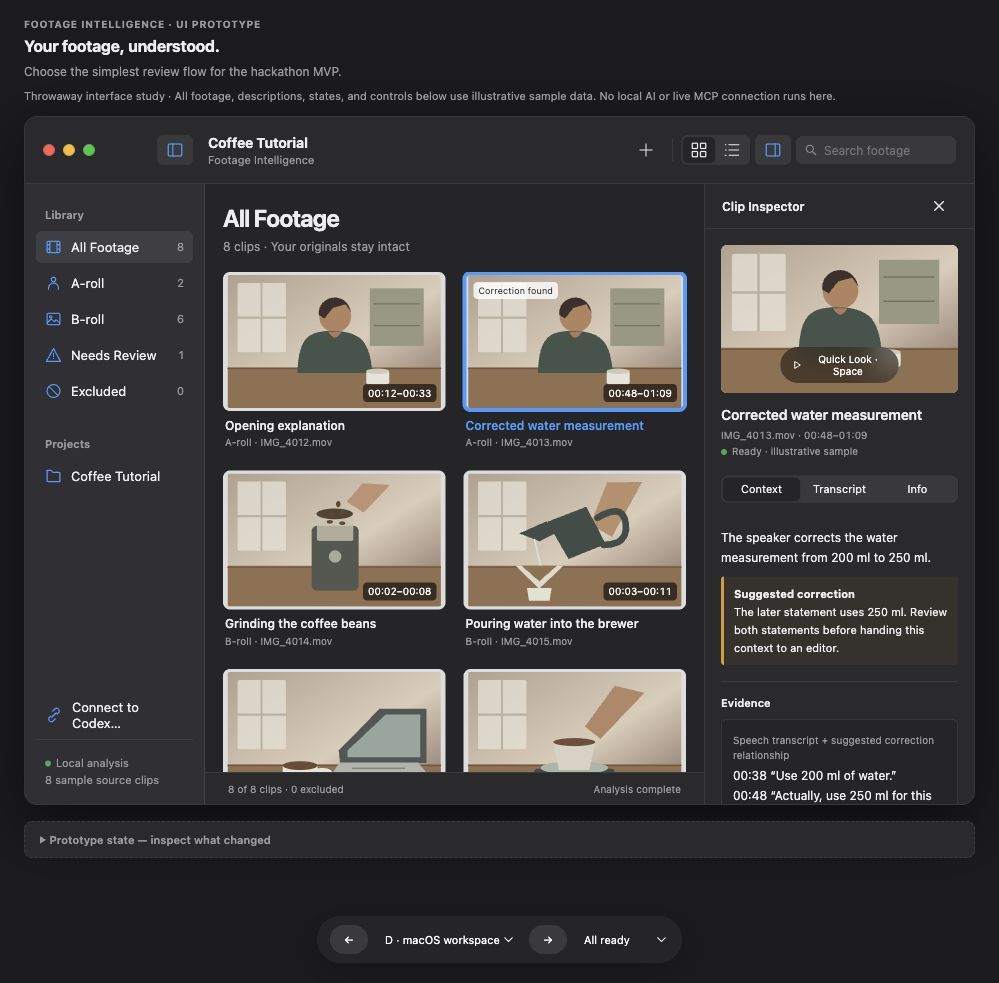

# Clipcon

**Your clips, in context.**

Clipcon is a local footage assistant for creators. It prepares searchable, source-grounded context from raw A-roll and B-roll on a Mac, then supplies relevant segments to an AI editing agent through MCP.

The approved MVP uses native SwiftUI, a local Python worker, Ollama/Qwen3.5, whisper.cpp, FFmpeg, SQLite, and a lightweight read-only MCP server. It provides footage knowledge; the downstream agent makes edits using its own tools.

## Project status

Tasks #2–#4 (one real clip, Codex retrieval through MCP, full-Project discovery) are complete. Task #5 (native review with notes and exclusions) is in review. Recovery, offline operation, and savings still need to be demonstrated. The image below is an approved browser design study with illustrative media, not a running native app.



## Build one task at a time

- [Approved MVP specification](https://github.com/angelobaricante/clipcon/issues/1)
- [Implementation tasks](https://github.com/angelobaricante/clipcon/issues)
- [First task: import one source clip and review real local context](https://github.com/angelobaricante/clipcon/issues/2)
- [Session handoff and tracker guide](docs/TRACKER.md)
- [Native design direction](docs/design/macos-design-notes.md)
- [Domain glossary](GLOSSARY.md)

For a new agent session, ask:

> Work on https://github.com/angelobaricante/clipcon/issues/2. Read AGENTS.md and the parent specification, verify dependencies, and implement the task through its acceptance checks. Record progress and validation in the issue before ending the session.

Later sessions use the next unblocked implementation issue. GitHub issues and their comments are the authoritative work state; this project does not depend on one chat's history.

## Demo boundaries

The initial target is a configured Apple Silicon Mac with English and Tagalog/Taglish footage. Initial runtime/model installation requires connectivity; useful local inference and index retrieval must then work offline. Codex's own remote inference may require internet. Preserve original footage, measure efficiency fairly, and distinguish live processing from cached context.

Model weights, raw footage, local indexes, and environment-specific caches are kept outside Git.

## Run the current slice (task #2: import one clip)

Verified on an M5 Mac (24 GB) with macOS 26.5.1 and Xcode 26.3. These are one-time setup steps and need internet:

```sh
brew install ffmpeg ollama whisper-cpp uv xcodegen
mkdir -p ~/.clipcon/models ~/.clipcon/logs
# Multilingual speech (English, Tagalog, Taglish), ~1.6 GB
curl -L -o ~/.clipcon/models/ggml-large-v3-turbo.bin \
  https://huggingface.co/ggerganov/whisper.cpp/resolve/main/ggml-large-v3-turbo.bin
# Voice activity detection, so silent B-roll gets no invented transcript (~0.9 MB)
curl -L -o ~/.clipcon/models/ggml-silero-v5.1.2.bin \
  https://huggingface.co/ggml-org/whisper-vad/resolve/main/ggml-silero-v5.1.2.bin
# Local Ollama: loopback only, cloud features disabled
OLLAMA_HOST=127.0.0.1:11434 OLLAMA_NO_CLOUD=1 ollama serve > ~/.clipcon/logs/ollama.log 2>&1 &
ollama pull qwen3.5:4b-q4_K_M
(cd worker && uv sync)
```

Day to day, one script starts and stops everything (local-only Ollama, worker dependencies, model warm-up, app build and launch):

```sh
scripts/clipcon start    # then import footage with ⇧⌘I
scripts/clipcon status   # Ollama, analysis readiness, app, Codex MCP helpers
scripts/clipcon stop     # quit the app, unload the model, stop the Ollama the script started
```

Or run the app from Xcode:

```sh
cd app && xcodegen generate && open Clipcon.xcodeproj   # then Run (⌘R)
```

Click **Import** (⇧⌘I), name the Project, describe the intended video, choose a clip, then click **Analyze**. Originals are read but never modified. The index and sampled frames live in `~/Library/Application Support/Clipcon/`.

Tests:

```sh
cd worker
uv run pytest                 # behavioral import/readiness checks (real FFmpeg, recorded inference)
uv run pytest -m real -s      # real whisper.cpp + Ollama smoke test; prints a timing/model report
```

Speech language is detected per clip (`CLIPCON_SPEECH_LANGUAGE=auto`); force it with `en` or `tl`. To fall back to the smaller English-only model, download `ggml-small.en.bin` and set `CLIPCON_WHISPER_MODEL=~/.clipcon/models/ggml-small.en.bin`. Tagalog/Taglish quality is only as good as measured on real footage; run `CLIPCON_TAGALOG_CLIP=/path/clip.mp4 uv run pytest -m real -s -k tagalog`.

The worker CLI is also usable directly: `uv run clipcon-worker readiness|warmup|projects|create-project|import|snapshot`.

## Connect Codex (task #3: MCP retrieval)

`clipcon-mcp` is a read-only stdio MCP server over the saved index. It loads no model and does not need the app to be running. Its five tools are `get_project_overview`, `search_footage`, `get_segment_context`, `get_segment_preview`, and `resolve_media`. Each tool takes an explicit `project_id` or `segment_id`.

## Review footage (task #5)

The sidebar filters All Footage, A-roll, B-roll, Needs Review (not ready yet, or a suggested correction/repeated take to choose between), and Excluded. Grid and list (⌘1/⌘2) share one selection. Double-click a clip (or press Space, or Clip ▸ Play, ⌘↓) to play its original over the browser, after Clipcon checks it is the indexed file (same size and modification time). The inspector stays beside the player: the Transcript tab highlights and follows the line being spoken, and clicking a line's time or a segment's range jumps playback there. Esc closes the player; ⌘Y opens the original in Quick Look. ⌘F focuses search.

In the inspector's Context tab, a **creator note** is saved through the worker when you leave the field. Codex receives it in `get_segment_context` as `creator_notes`, kept apart from transcript, observations, and interpretation, and `search_footage` matches it as `creator_note` evidence. **Include in retrieval** (or Clip ▸ Exclude from Retrieval, ⇧⌘E) is reversible. Excluded clips leave new default `search_footage` results and relationship suggestions; `include_excluded: true` still finds them. Context Codex already retrieved is not revoked: fetching an excluded Segment by ID returns it with `excluded: true`. From the command line: `clipcon-worker set-note --clip ID --text "…"` and `clipcon-worker set-excluded --project ID --excluded yes|no CLIP_ID…`.

Open the setup sheet by clicking the readiness badge in the sidebar. The **Codex connection (MCP)** section runs a live MCP session against the index and shows the exact registration command. On this Mac the command is:

```sh
codex mcp add clipcon -- ~/clipcon/worker/.venv/bin/clipcon-mcp --home "$HOME/Library/Application Support/Clipcon"
```

The tools are annotated read-only, so Codex runs them without approval prompts. `resolve_media` returns a path only when the original file is still present and unchanged (same size and modification time). A returned path is only a locator: Codex reads the file with its own normal access to this Mac.

Verified working: Python MCP SDK `mcp` 2.3.0 (negotiated protocol `2026-07-28`) with `codex-cli 0.162.0-alpha.2`, the CLI bundled in the ChatGPT app. The Homebrew `codex-cli 0.154.0` completed the MCP handshake. Its turn then failed because that CLI rejected the account's configured default model (`gpt-6.1-sol`), so no tool call was observed through it. Check it yourself with `clipcon-worker mcp-status`.
